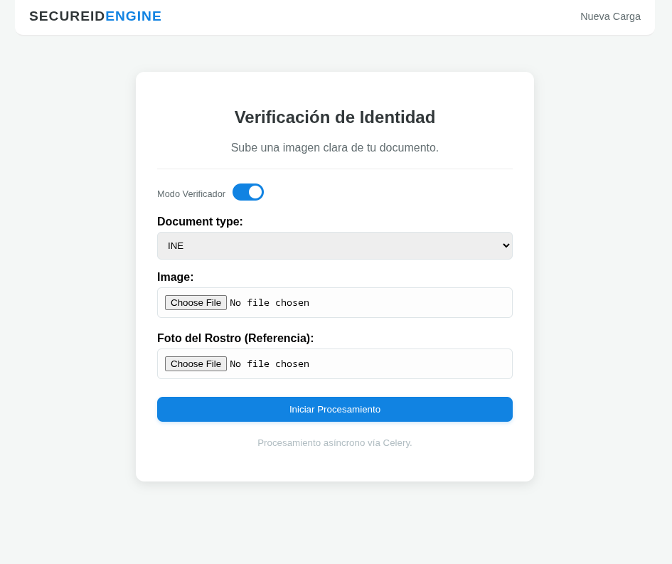
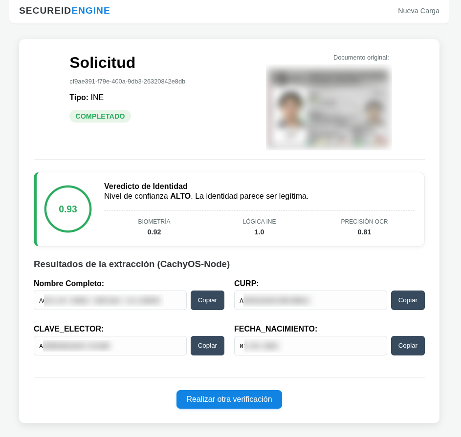
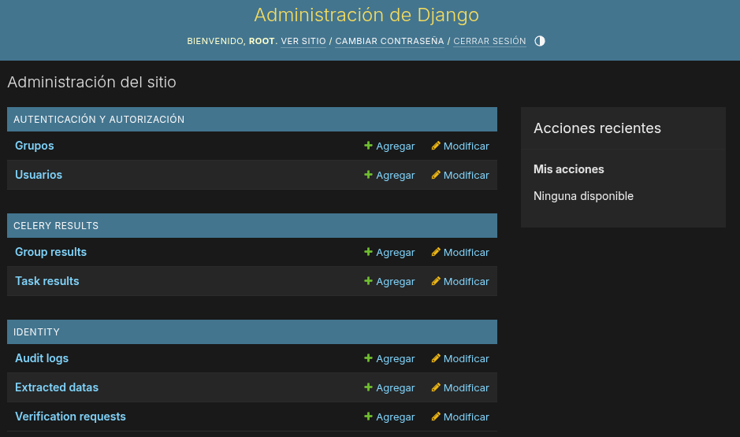

# 🛡️ SecureID Engine

<p align="center">
  
  
  
  
</p>

<p align="center">
  
  
  <a href="https://github.com/nowhereOnce"></a>
</p>

<p align="center">
  <b>Español</b> | <a href="README.md">English</a>
</p>

---

### Sistema Distribuido de Verificación de Identidad y Análisis Biométrico

**SecureID Engine** es una solución robusta de grado industrial diseñada para la automatización del proceso de validación de identidad, con un enfoque específico en documentos de identificación mexicanos (INE). El sistema utiliza una arquitectura de microservicios orquestada con **Docker**, empleando procesamiento asíncrono para garantizar alta disponibilidad y escalabilidad.

<p align="center">
  
</p>

-----

## 🚀 Características Principales

El sistema opera bajo dos modalidades de procesamiento configurables desde la interfaz:

1.  **Modo Extracción (Simple OCR):** \* Extracción automatizada de metadatos críticos: **Nombre completo, CURP, Clave de Elector y Fecha de Nacimiento**.

      * Ideal para flujos de registro rápido donde la consistencia visual es suficiente.

2.  **Modo Verificación (Full Evaluation):**

      * **Biometría Facial:** Comparación de 128 puntos de referencia faciales entre la identificación y una selfie de referencia mediante la librería `face_recognition`.
      * **Lógica de Consistencia (Triple Check):** Algoritmo propio que valida la integridad de los datos cruzando la fecha de nacimiento impresa con los algoritmos de generación de CURP y Clave de Elector.
      * **Global Trust Score:** Cálculo de un índice de confianza global basado en pesos configurables ($S = w_1 \cdot C_f + w_2 \cdot C_l + w_3 \cdot C_d$).

<p align="center">
  
</p>

-----

## 🛠️ Stack Tecnológico

  * **Backend:** Django (Python 3.11).
  * **Procesamiento Asíncrono:** Celery + Redis (Broker de mensajes).
  * **Base de Datos:** PostgreSQL (Persistencia de auditoría y resultados).
  * **Visión Artificial e IA:**
      * **EasyOCR:** Extracción de texto con soporte para GPU.
      * **OpenCV:** Preprocesamiento de imágenes (Umbralización de Otsu) para mejorar la precisión del OCR.
      * **Face Recognition (dlib):** Modelos de red neuronal para codificación facial.

-----

## 💻 Requerimientos del Sistema

Para garantizar un rendimiento óptimo de los modelos de visión artificial y el procesamiento asíncrono, se sugieren las siguientes especificaciones:

| Componente | Versión CPU (Estándar) | Versión GPU (AMD ROCm) |
| :--- | :--- | :--- |
| **Procesador** | 4+ Núcleos (Recomendado) | 2+ Núcleos |
| **RAM** | 4GB (Mínimo) / 8GB (Rec.) | 8GB (Mínimo) |
| **GPU** | N/A | AMD RDNA2+ (Ej. RX 6600 o superior) |
| **VRAM** | N/A | 4GB (Mínimo) |
| **Almacenamiento** | ~5GB Libres | 25GB+ Libres (Imagen ROCm pesada) |
| **Sistema Operativo** | Linux / macOS / Windows | Linux (Con soporte KFD/amdgpu) |

> **Nota:** La versión GPU requiere drivers específicos de AMD y una configuración de kernel compatible con ROCm para la comunicación con el hardware.

-----

## 📦 Instalación y Despliegue

El proyecto está completamente contenedorizado para garantizar la portabilidad entre entornos de desarrollo (CPU) y producción (GPU).

### 1\. Configuración de Variables de Entorno

Crea un archivo `.env` en la raíz del proyecto basándote en la siguiente estructura:

```env
# Database
POSTGRES_DB=secureid_db
POSTGRES_USER=postgres
POSTGRES_PASSWORD=your_secure_password

# Django
SECRET_KEY=django-insecure-your-key-here
DEBUG=True
ALLOWED_HOSTS=localhost,127.0.0.1

# Celery / Redis
CELERY_BROKER_URL=redis://redis:6379/0
WORKER_NAME=Node-Alpha
```

### 2\. Despliegue con Docker

Para ejecutar el sistema utilizando únicamente la **CPU** (Versión Ligera de \~500MB para el contenedor Web):

```bash
# Construir e iniciar contenedores
docker compose up -d --build

# Realizar migraciones de base de datos
docker compose exec web python manage.py migrate

# Crear el usuario administrador (Root)
docker compose exec web python manage.py createsuperuser
```

-----

## 🖥️ Uso del Sistema

1.  **Portal Web (`/upload/`):** Sube la imagen de la INE y, si activas el "Modo Verificador", una selfie. El sistema enviará la tarea al Worker de forma asíncrona.
2.  **Dashboard de Detalle (`/verification/<uuid>/`):** Visualiza los resultados, el score de confianza y el estatus de la tarea en tiempo real.
3.  **Portal de Administración (`/admin/`):** Gestiona todas las solicitudes, revisa los logs de auditoría y los tiempos de ejecución de cada nodo de procesamiento.

<p align="center">
  
</p>

---

## ⚡ Aceleración por GPU (AMD ROCm)

Para entornos que cuentan con hardware compatible (especialmente GPUs AMD con arquitectura RDNA2 o superior), el sistema permite desplazar la carga computacional del OCR a la GPU para reducir los tiempos de inferencia significativamente.

### 1. Configuración del Entorno (.env)
Asegúrate de definir las siguientes variables para habilitar el motor de hardware:

```env
# Define el Dockerfile de alto rendimiento
WORKER_DOCKERFILE=Dockerfile.gpu

# Habilita el flag interno para el uso de GPU en EasyOCR y modelos
WORKER_GPU_ENABLED=true

# Compatibilidad específica para RX 6600/6650 XT (Navi 23)
HSA_OVERRIDE_GFX_VERSION=10.3.0
```

### 2. Modificaciones en `docker-compose.yml`
Para permitir que el contenedor acceda directamente al kernel de video y a los descriptores de renderizado de Linux, actualiza la sección del `worker`:

```yaml
  worker:
    build:
      context: .
      dockerfile: ${WORKER_DOCKERFILE:-Dockerfile}
    # ...
    # Acceso directo al hardware de aceleración
    devices:
      - "/dev/kfd:/dev/kfd" # Interfaz de cómputo para ROCm
      - "/dev/dri:/dev/dri" # Renderizado directo
    
    # Grupos de sistema necesarios para el acceso a GPU
    group_add:
      - video
      - render
    
    environment:
      - WORKER_GPU_ENABLED=${WORKER_GPU_ENABLED}
      - HSA_OVERRIDE_GFX_VERSION=${HSA_OVERRIDE_GFX_VERSION}
      # ... resto de variables
```

### 3. Consideraciones Técnicas
* **Imagen Base:** El uso de GPU requiere la imagen `rocm/pytorch`, la cual incluye las librerías necesarias para la comunicación con los drivers de AMD en sistemas Linux (probado en CachyOS/Arch Linux). Esta versión de la imagen aumenta considerablemente su tamaño respecto a la versión original.

-----

## 🔒 Aviso de Privacidad (Demo & Open Source)

**SecureID Engine** es un proyecto estrictamente **demostrativo y de código abierto**. Al ser un software auto-hospedado (*on-premise*), el responsable del tratamiento de los datos personales es la persona o entidad que ejecute la instancia del software.

*   **Propósito:** Procesamiento técnico de identificaciones oficiales (OCR y Biometría) para validación de identidad.
*   **Datos Procesados:** Nombre completo, CURP, Clave de Elector y biometría facial.
*   **Responsabilidad:** El desarrollador original no tiene acceso, control ni capacidad de visualización sobre los datos, imágenes o resultados generados en instalaciones externas.

Se recomienda utilizar este sistema en entornos de prueba controlados y eliminar los datos sensibles tras completar las validaciones técnicas.

-----
## 🙏 Agradecimientos

Un agradecimiento especial al **Ing. Angel Brito**, por sus invaluables observaciones y el feedback técnico proporcionado. Sus sugerencias fueron fundamentales para elevar la calidad de este proyecto y asegurar un estándar profesional desde su primer lanzamiento.

-----

## 👨‍💻 Autor

**Enrique Alejandro Aguilar Ramos** *Ingeniero en Computación por la UNAM* *Enfocado en Backend escalable e integración de IA.* [GitHub: nowhereOnce](https://www.google.com/search?q=https://github.com/nowhereOnce)
